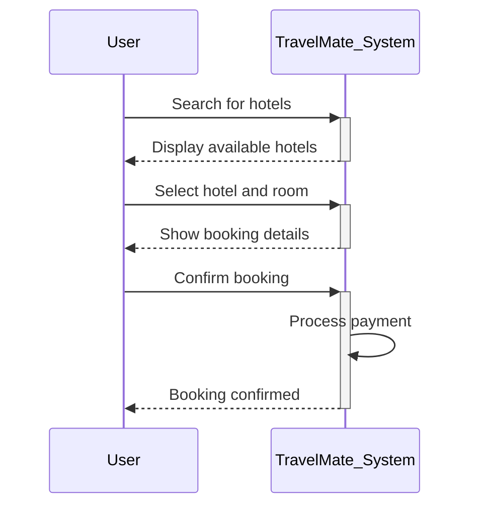

# Feature: Booking Flow

## Use Case: Book a Hotel Room

This diagram shows the main hotel booking process in TravelMate. The user searches for a hotel, selects a room, completes the payment, and receives a booking confirmation from the system.

